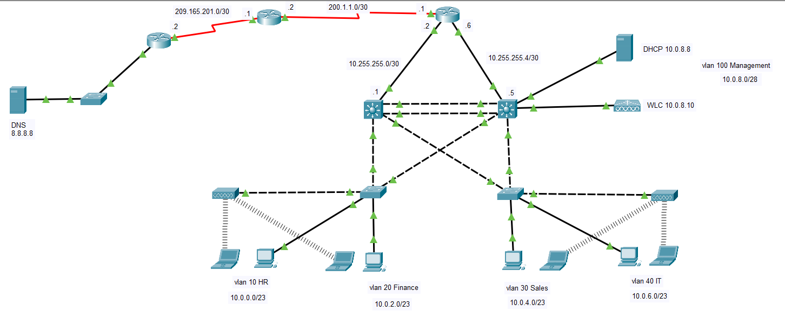
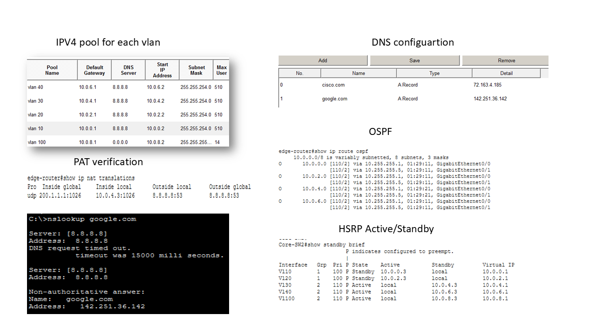

# Enterprise Network Lab

## Overview

The aim of this project is to design a secure and highly available network for a small enterprise using Cisco technologies.

## Topology

## Cisco Technologies

* Virtual Local Area Networks (VLANs)
* Switch Virtual Interfaces (SVIs)
* Per-VLAN Spanning Tree Plus (PVST+)
* EtherChannel (PAgP)
* Hot Standby Router Protocol (HSRP)
* Open Shortest Path First (OSPF)
* Dynamic Host Configuration Protocol (DHCP)
* Network Address Translation (NAT/PAT)

---

## VLAN Segmentation

The enterprise network is divided into four departments. Each department has its own VLAN and subnet with up to 510 usable IPv4 addresses.

| VLAN | Department | Network     |
| ---- | ---------- | ----------- |
| 10   | HR         | 10.0.0.0/23 |
| 20   | Finance    | 10.0.2.0/23 |
| 30   | Sales      | 10.0.4.0/23 |
| 40   | IT         | 10.0.6.0/23 |

---

## Inter-VLAN Routing and Redundancy

Inter-VLAN routing is performed through SVIs configured on the core switches.

To provide traffic load sharing and a loop-free Layer 2 design, PVST+ is configured with different root bridges for different VLANs:

* Core-SW1 is the primary root bridge for VLANs 10 and 20, and secondary for vlan 30,40, and 100.
* Core-SW2 is the primary root bridge for VLANs 30, 40, and 100, and secondary for vlan 10 and 20.

HSRP is configured on both core switches to provide gateway redundancy. If one core switch fails, the other automatically takes over and maintains connectivity to the edge router.

---

## Routing

The core switches and the edge router are connected through OSPF to provide dynamic routing and automatic route exchange.

The internal network uses the non-routable private address space 10.0.0.0/16. Internet access is provided through NAT overload (PAT),all internal hosts are translated to the public IP address 200.1.1.1 using different port numbers.

---

## DHCP Services

A centralized DHCP server provides:

* IP addresses
* Subnet masks
* Default gateways
* DNS server information

Each VLAN has its own  convenient DHCP scope.

---

## Wireless LAN

The wireless infrastructure consists of two lightweight access points managed by a Wireless LAN Controller (WLC).

This design provides centralized wireless management and allows wireless clients to connect securely to the enterprise network.

## Commands

